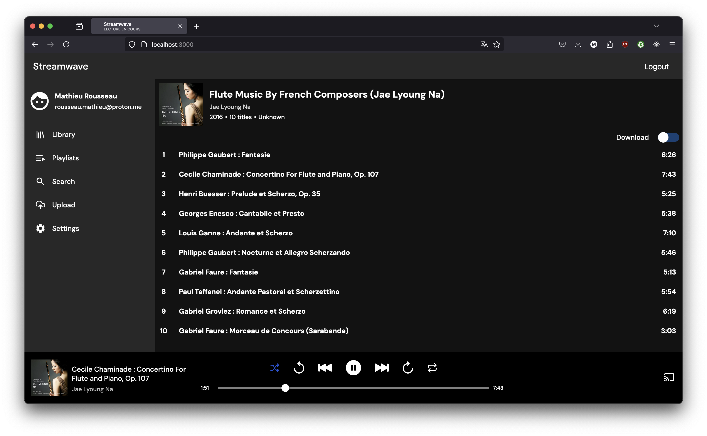

# streamwave-monolith



The goal for this new project is to rework Streamwave with a modern stack.

### Legacy Web App

- streamwave-legacy: https://github.com/Mathieu-R/streamwave-legacy

### Legacy APIs

- streamwave-library: https://github.com/Mathieu-R/streamwave-library
- streamwave-auth: https://github.com/Mathieu-R/streamwave-auth

What changed ?

- Focus on desktop (v1).
- PostgreSQL instead of MongoDB.
- Inngest for jobs that can be done in background.
- Using session cookies instead of passing JWT to the request.
- Using orpc for typesafe api.
- No global state management, using context instead.
- Remove APIs that are still not widely supported by browsers.

### Tech

- [x] [React](https://react.dev/)
- [x] [Drizzle ORM](https://orm.drizzle.team/)
- [x] [Orpc](https://orpc.dev/)
- [x] [Hono](https://hono.dev/)
- [x] [Inngest](https://www.inngest.com/)

### Usage

#### Prepare media files

Prepare some media files you want to stream in the application.  
You can use the command line tool [metadatapp](https://github.com/Mathieu-R/metadatapp) to extract metadata and create necessary files needed for streaming.  
Then, move the data folder in the `cdn` folder.

#### Generate Google and GitHub OAuth2 secrets

**Google**  
Go to https://console.cloud.google.com and create a new project.  
Then go to APIs and services > Credentials then create an `OAuth 2.0 Client`. Take note of **Client ID**, **Client secret**.  
You need to set the **Authorised JavaScript origins** to `http://localhost:3000` and **Authorised redirect URIs** to `http://localhost:3000/login/google/callback`.

**GitHub**  
Go to https://github.com/settings/developers and create a new project. Take note of **Client ID**, **Client secret**.  
Then set **Application Name**, **Homepage URL** to `http://localhost:3000` and **Authorization callback URL** to `http://localhost:3000/login/github/callback`.

### Set environment variables

Set environment variables following .env.example file.

#### Run

```
pnpm install
pnpm run build
pnpm run start
```
